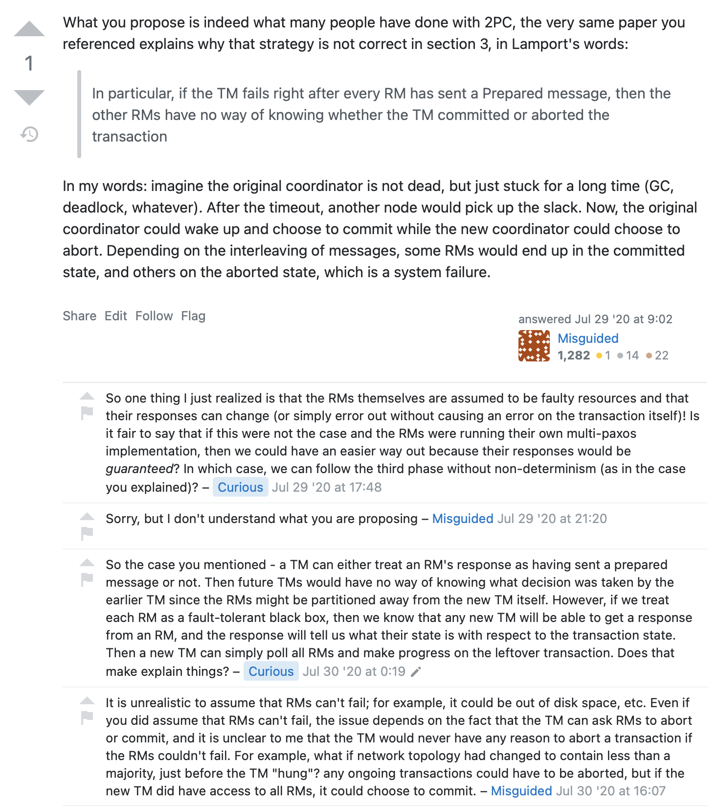

We will evolve 2PC into Paxos and Raft in this article.

<!-- more -->

## 2PL vs. 2PC

2PL is non-distributed, handling interference of N transactions on 1 node.
2PC is distributed, handling atomic transaction commit of 1 transaction on N nodes

## 2PC

There are these phases:
1. All N acceptors return promise to commit
2. All N acceptors are told by proposer to actually do the commit
3. Proposer gets N acknowledgements, 1 from each of N acceptors
4. The transaction will commit successfully iff ALL following conditions are true:
   1. Proposer does not die after Phase 1
   2. No acceptor dies
   3. Proposer is able to successfully send/recv messages to all N acceptors for all phases
   4. If the Phase 1 contains the transaction identified by a unique identifier from the proposer, then Phase 2 and Phase 3 can be retried in a loop until it succeeds.

```python
phase_1() {
    send promise to commit requests to all N acceptors
    wait until N promises arrive
}
 
phase_2() {
    while(1) {
        if all acceptors have acknowledged
             break
 
        for each acceptor not acknowledged
             send commit to that acceptor
             wait till timeout for acknowledgment
             if acknowledged remove from pending acceptor list
    }
}
 
main() {
    phase_1
    phase_2
}
```

Limitation of 2PC hence is that it is not fault-tolerant to either proposer or acceptor failures.

By default the transaction is blocked until the same coordinator is resurrected.

**Q:** Why cannot a new coordinator query the acceptors, determine the current state of the transaction and either proceed to abort or commit it? 

**A:** That works as long as you can guarantee that the old coordinator is dead. If old one comes back in the middle of the new coordinator resolving that transaction then the same transaction can be fixed up by two coordinators and atomicity and consistency is lost.

**Q:** What if the coordinator logs and replicates the transaction state. And a new coordinator is picked up as leader to resume the transaction and finish (commit or abort) it?

**A:** Yes, that will work. This is no different from the original coordinator pausing for a bit and then coming back up again.

**Q:** Is this what Spanner does?

**A:** Yes. I think so.

**Q:** Can you confirm?

**A:** ...

**Q:** What is the overhead of doing this for spanner? What is the overhead compared to federated paxos?

**A:** [YugaByte distributed 2PC transaction manager](https://blog.yugabyte.com/yes-we-can-distributed-acid-transactions-with-high-performance)



## 3PC

In 2PC, acceptor 1 can only commit a message if it is notified that all other acceptors have also promised to commit. Since the proposer died after phase 1, there is no way for acceptor 1 to determine if it should commit the entry.

Similarly, acceptor 1 cannot simply abort the entry. It is possible for proposer to die after it has sent commits to 2-N acceptors and only acceptor 1 did not get the commit message. If the acceptor 1 aborts the message, it will lead to inconsistent system.

In summary, an acceptor is permanently stuck waiting for the proposer to tell it whether to commit/abort the entry via the phase 2 message.

The underlying issue here is that the message to do the commit and indicate that a commit is possible is clubbed into 1 message in phase 2. If this was split up into 2 distinct messages, the first message of phase 2 can tell acceptor 1 that all other acceptors have promised to commit and hence it should prepare to commit as well. And the subsequent message in phase 2 can actually ask the acceptor 1 to do the commit.

In this model, if the proposer dies and acceptor 1 got the prepare to commit, but acceptor 2 did not, it means that the proposer did not finish the prepare to commit phase. However, neither acceptor 1 nor acceptor 2 can independently determine to commit or rollback the entry, because as per just local information, acceptor 1 will commit the message and acceptor 2 will roll it back.

If the recovery proposer, notices that acceptor 1 is in prepare to commit, but acceptor 2 is not, then it can conclude that previous proposer had decided to commit it and it can continue driving it to conclusion. If none of the acceptors are in prepare to commit, it guarantees that the dead acceptor could not have proceeded to the commit phase (because getting to commit phase requires N acks for prepare to commit phase). Proposer can roll it back on the alive acceptors. If we assume that dead acceptors cannot resurrect, then the proposer can retrieve the entire transaction again from the beginning.

If the dead acceptor resurrects,

## Techniques for sequence number generation

### Single server

All requests go to a single server. This serializes all requests and assigns sequence numbers in timestamp order. Downsides are obvious.

### Distributed 100% unique

UUIDs can theoretically collide and need to be confirmed for uniqueness. Instead if 100% uniqueness is needed we can follow this format.

The UUID is composed of (timestamp, seq_num, unique_node_id). This generates almost monotonically increasing unique sequence numbers. If retriever pulls from multiple partitions the number can regress for a bit. If strictly increasing is required, the retriever can ignore that number and pull more numbers again until the number increases. This can however generate holes though and does not generate strictly increasing dense sequece numbers

### Distributed dense increasing sequence number

1. single sequence counter node
   1. Cons
      1. SPOF
      2. cannot scale
2. distributed sequence counters
   1. increasing + unique + dense
   2. increasing + unique + holes
   3. unique

### increasing + unique + dense distributed counters

* if 2 requests R1 and R2 aren't arriving same node, then to order them you (a) need to send them to an ordering node

* N shards
* each shard replicated
* N decided by scalability
* request can reach any of them
* R1 arrives N1
* R2 arrives N2 same time
* An ordering needs to be established between the two
* The arrival time on each N1 and N2 can be locally different
* There needs to be some mechanism to tie break between the two
* We need an arbitrary notion of R1 and R2 arriving at the same time across the system